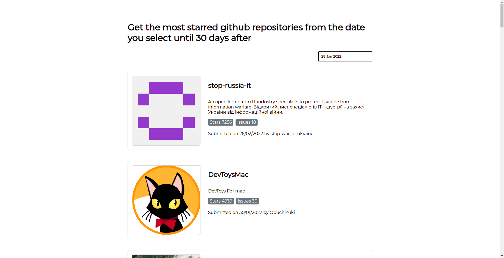

# coding-test
> Built with VueJs

## Synopsis

Build a small web app that list the most starred repositories from the selected date until 30 days after
 


## Libraries used
- [Axios](https://github.com/axios/axios) for handling http requests
- [Moment.js](https://github.com/moment/moment) for more ease on manipulating and formatting dates
- [vue-infinite-loading](https://github.com/PeachScript/vue-infinite-loading) for more ease on handling infinite scrolling instead of using javascript scroll event

### Get started
``` 

git clone git@github.com:oumy17/coding-test.git

cd coding-test

yarn install

yarn serve 

```
### Compiles and minify for production
```
yarn build
```


### Lints and fixes files
```
yarn lint
```

